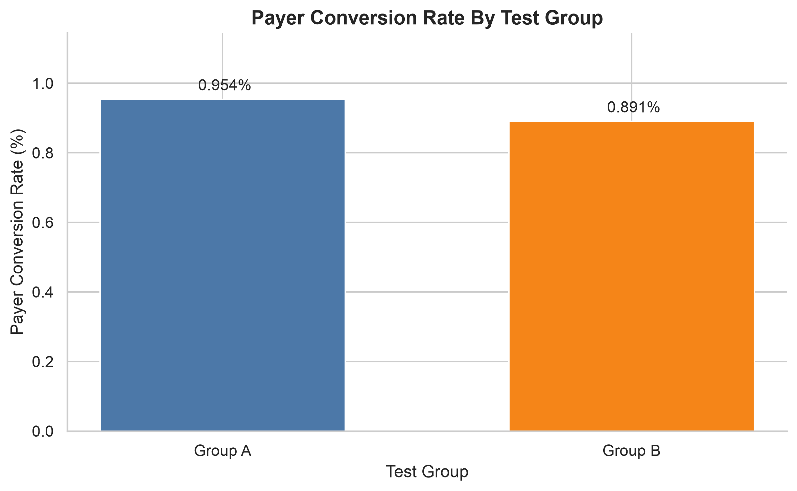
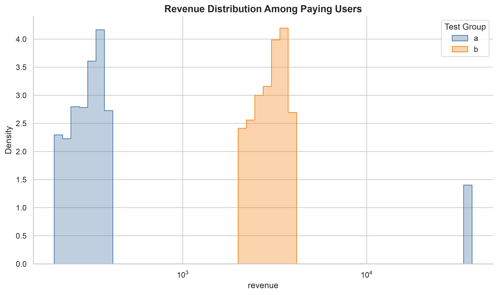
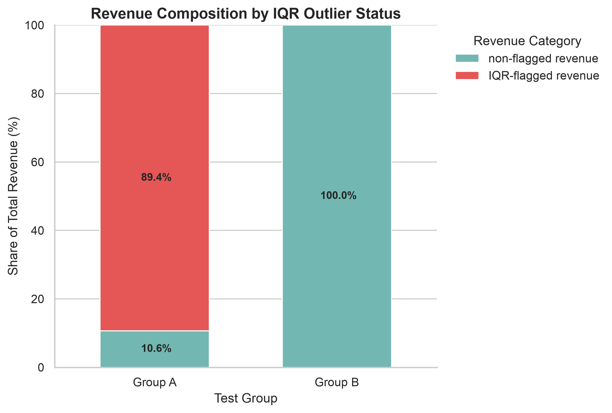
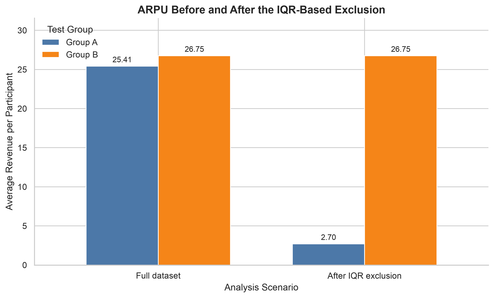
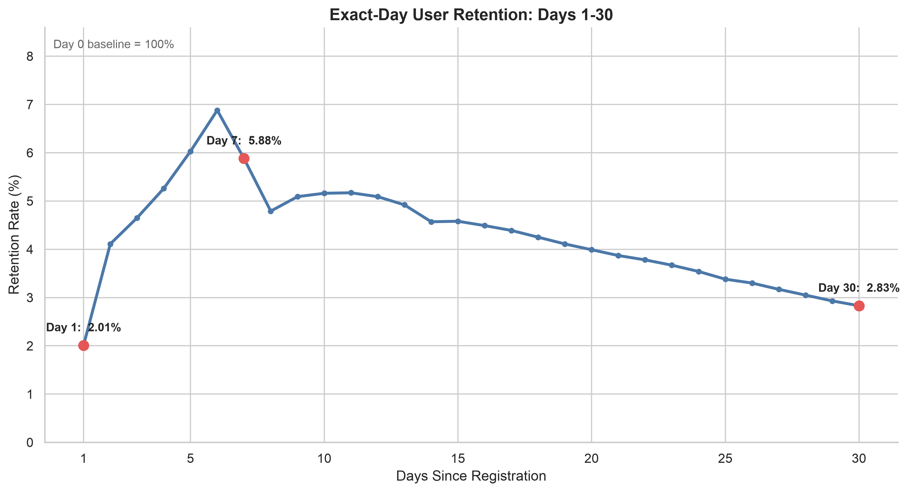
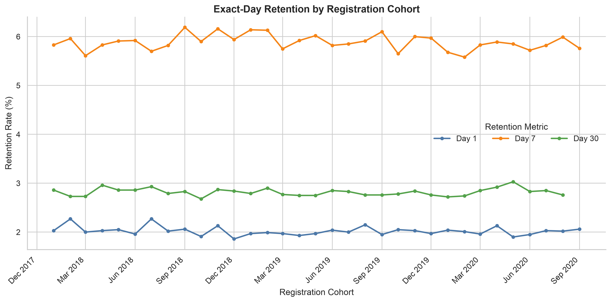

# Mobile Game Retention and A/B Testing

Product analytics case study examining player retention, cohort behaviour, monetisation, revenue concentration, and A/B-test performance using PostgreSQL, Python, and Tableau.

## Interactive Tableau Dashboard

[View the interactive dashboard on Tableau Public](https://public.tableau.com/views/mobile_game_retention_dashboard_working/RevenueandConversion)

## Table of Contents

- [Project Overview](#project-overview)
- [Business Questions](#business-questions)
- [Dataset](#dataset)
- [Tools and Technologies](#tools-and-technologies)
- [Repository Structure](#repository-structure)
- [Analytical Approach](#analytical-approach)
  - [Retention Analysis](#retention-analysis)
  - [A/B-Test Analysis](#ab-test-analysis)
- [Key Metrics](#key-metrics)
- [Statistical Analysis](#statistical-analysis)
  - [Payer Conversion](#payer-conversion)
  - [Revenue per Participant](#revenue-per-participant)
  - [Revenue Sensitivity Analysis](#revenue-sensitivity-analysis)
- [Key Findings](#key-findings)
  - [A/B-Test Results](#ab-test-results)
  - [Retention Results](#retention-results)
- [Tableau Dashboards](#tableau-dashboards)
- [Business Recommendation](#business-recommendation)
- [Event KPI Framework](#event-kpi-framework)
- [Limitations](#limitations)
- [How to Run the Project](#how-to-run-the-project)
- [Author](#author)

## Project Overview

This project investigates two areas of mobile-game product performance:

1. Player retention after registration, including exact-day retention and monthly cohort behaviour.
2. A promotional-offer experiment comparing Group A and Group B on payer conversion and monetisation.

The project combines:

- SQL for database setup, data-quality validation, cohort construction, and metric calculation.
- Python for statistical testing, sensitivity analysis, and visualisation.
- Tableau for interactive dashboards presenting revenue, conversion, and retention results.

The retention and A/B-test datasets are analysed separately because their player identifiers have not been validated as a common key. Therefore, this analysis does not attribute retention differences to the A/B-test groups.

## Business Questions

This project addresses the following questions:

- When do registered players return during their first 30 days?
- How stable are Day 1, Day 7, and Day 30 retention rates across registration cohorts?
- Which experimental group generates stronger payer conversion?
- Which group generates greater revenue per participant and revenue per paying user?
- Are the observed revenue differences statistically reliable?
- Are the monetisation results influenced by a small number of extreme spenders?
- Should Group B be rolled out based on the available evidence?
- Which KPIs should be monitored for a time-limited in-game event?

## Dataset

This project uses the [Gamelytics: Mobile Analytics Challenge](https://www.kaggle.com/datasets/debs2x/gamelytics-mobile-analytics-challenge) dataset from Kaggle.

The dataset is published by **debs2x** under the **Apache 2.0 License**.

| File | Description | Records |
|---|---|---:|
| `reg_data.csv` | Player registration timestamps and user IDs | 1,000,000 |
| `auth_data.csv` | Player authentication activity and user IDs | 9,601,013 |
| `ab_test.csv` | A/B-test assignments and player revenue | 404,770 |

The original CSV files are stored locally in `data/raw/` and excluded from Git because of their size. They can be downloaded directly from Kaggle.

## Tools and Technologies

| Tool | Purpose |
|---|---|
| PostgreSQL | Database setup, quality checks, retention calculations, cohort analysis, and A/B-test summaries |
| Python | Statistical testing, sensitivity analysis, data validation, and chart generation |
| pandas and NumPy | Data manipulation and metric calculation |
| SciPy | Welch’s t-test and statistical calculations |
| statsmodels | Two-proportion z-test |
| Matplotlib and Seaborn | Analytical visualisations |
| Jupyter Notebook | Reproducible Python analysis |
| Tableau Public | Revenue, conversion, and retention dashboards |
| Git and GitHub | Version control and project documentation |

## Repository Structure

```text
Mobile-Game-Retention-AB-Testing/
├── data/
│   └── raw/                                  # Original Kaggle CSV files; excluded from Git
│
├── images/
│   ├── arpu_primary_vs_sensitivity.png
│   ├── day_1_to_30_retention_curve.png
│   ├── monthly_cohort_retention_trends.png
│   ├── payer_conversion_rate_by_group.png
│   ├── payer_revenue_distribution.png
│   └── revenue_composition_by_outlier_status.png
│
├── notebooks/
│   └── 01_ab_test_statistical_analysis.ipynb
│
├── outputs/
│   ├── ab_test_group_summary.csv
│   ├── monthly_cohort_retention.csv
│   ├── outlier_revenue_summary.csv
│   ├── payer_revenue_quartiles.csv
│   ├── retention_curve.csv
│   ├── sensitivity_analysis_summary.csv
│   └── statistical_test_results.csv
│
├── sql/
│   ├── 00_database_setup.sql
│   ├── 01_data_quality_checks.sql
│   ├── 02_ab_test_analysis.sql
│   └── 03_retention_analysis.sql
│
├── tableau/
│   └── mobile_game_retention_dashboard_working.twb
│
├── .gitignore
└── README.md
```

A separate `data/processed/` folder is not required because prepared analytical results are stored in `outputs/`, while SQL views and queries handle transformations inside PostgreSQL.

## Analytical Approach

### Retention Analysis

The retention analysis follows these steps:

1. Convert Unix registration and authentication timestamps to UTC calendar dates.
2. Deduplicate multiple authentication records for the same player and activity date.
3. Calculate the number of days between registration and each authentication date.
4. Define the eligible population separately for each retention day.
5. Calculate exact-day retention for Days 1–30.
6. Calculate Day 1, Day 7, and Day 30 retention by registration cohort month.
7. Preserve immature cohort observations as missing values rather than treating them as zero retention.

Exact-day retention measures whether a player was active on a specific day after registration. It is not a cumulative survival measure, so a later day’s retention rate can be higher than an earlier day’s rate.

### A/B-Test Analysis

The A/B-test analysis follows these steps:

1. Validate participant counts, missing values, duplicates, group assignments, and revenue values.
2. Calculate participants, paying users, payer conversion, total revenue, ARPU, and ARPPU for each group.
3. Compare payer conversion using a two-proportion z-test.
4. Compare revenue per participant using Welch’s independent-samples t-test.
5. Calculate a bootstrap confidence interval for the ARPU difference.
6. Examine payer-revenue quartiles and revenue distributions.
7. Identify unusually high payer revenue using a group-level IQR rule.
8. Measure how much revenue is generated by IQR-flagged users.
9. Repeat the group comparison after excluding flagged observations as a sensitivity analysis.

The IQR exclusion is used only as a sensitivity test. It does not prove that the flagged transactions are invalid.

## Key Metrics

### Exact-Day Retention

```text
Exact-Day Retention =
Users active exactly d days after registration
÷
Users eligible to have reached day d
```

### Payer Conversion Rate

```text
Payer Conversion =
Paying Users
÷
All Experiment Participants
```

### Average Revenue per Participant

```text
ARPU =
Total Revenue
÷
All Experiment Participants
```

In this project, ARPU refers to average revenue per experiment participant.

### Average Revenue per Paying User

```text
ARPPU =
Total Revenue
÷
Paying Users
```

### Revenue Concentration

```text
Revenue Concentration =
Revenue from IQR-flagged users
÷
Total Group Revenue
```

## Statistical Analysis

### Payer Conversion

| Measure | Result |
|---|---:|
| Group A conversion | 0.9540% |
| Group B conversion | 0.8906% |
| Difference, B − A | −0.0633 percentage points |
| Relative change | −6.64% |
| z-statistic | −2.1080 |
| p-value | 0.0350 |
| 95% confidence interval | [−0.1222, −0.0044] percentage points |

Group B’s payer conversion rate is statistically significantly lower than Group A’s at the 5% significance level.

Although the absolute difference is small, it represents a relative conversion decrease of approximately 6.64%.



### Revenue per Participant

| Measure | Result |
|---|---:|
| Group A ARPU | 25.4137 |
| Group B ARPU | 26.7513 |
| Difference, B − A | 1.3376 |
| Relative lift | 5.26% |
| Welch t-statistic | 0.6235 |
| p-value | 0.5330 |
| Bootstrap standard error | 2.2041 |
| Bootstrap 95% confidence interval | [−3.0478, 5.2873] |

Group B has an observed ARPU approximately 5.26% higher than Group A. However, the difference is not statistically significant.

Both the Welch-test result and bootstrap confidence interval indicate that the observed increase could be caused by sampling variation. Therefore, the experiment does not provide sufficient evidence that Group B genuinely increases average revenue per participant.

### Revenue Sensitivity Analysis

The payer-revenue distribution is highly uneven.

For Group A:

- First quartile: 257
- Third quartile: 361
- IQR: 104
- Upper IQR boundary: 517
- IQR-flagged paying users: 123
- Flagged users as a share of Group A payers: 6.38%
- Revenue generated by flagged users: 89.37% of Group A revenue

For Group B:

- First quartile: 2,513
- Third quartile: 3,478
- IQR: 965
- Upper IQR boundary: 4,925.5
- IQR-flagged paying users: 0





After excluding IQR-flagged observations:

| Metric | Group A | Group B |
|---|---:|---:|
| Participants | 201,980 | 202,667 |
| Paying users | 1,805 | 1,805 |
| Total revenue | 545,937 | 5,421,603 |
| ARPU | 2.7029 | 26.7513 |
| Payer conversion | 0.8937% | 0.8906% |
| ARPPU | 302.46 | 3,003.66 |

The resulting ARPU difference is 24.0484 in favour of Group B, equivalent to an estimated relative lift of 889.72%.

The sensitivity comparison produces:

- Welch t-statistic: 37.4885
- p-value: less than 0.001
- 95% confidence interval: [22.7911, 25.3057]



This dramatic reversal demonstrates that the experiment’s revenue conclusion is highly sensitive to a small number of high-value users in Group A.

The sensitivity result should not replace the full-data result automatically. The flagged observations must first be investigated to determine whether they represent legitimate high-value customers, tracking errors, duplicated transactions, fraud, or another data-quality issue.

## Key Findings

### A/B-Test Results

| Metric | Group A | Group B |
|---|---:|---:|
| Participants | 202,103 | 202,667 |
| Paying users | 1,928 | 1,805 |
| Payer conversion | 0.9540% | 0.8906% |
| Total revenue | 5,136,189 | 5,421,603 |
| ARPU | 25.41 | 26.75 |
| ARPPU | 2,664.00 | 3,003.66 |
| Maximum player revenue | 37,433 | 4,000 |

The main findings are:

- Group A converts a larger proportion of participants into paying users.
- Group B generates higher observed total revenue, ARPU, and ARPPU.
- Group B’s lower payer conversion is statistically significant.
- Group B’s full-sample ARPU advantage is not statistically significant.
- Group A contains a small number of extremely high-value users.
- Group A’s revenue is highly concentrated among its IQR-flagged users.
- The apparent revenue advantage changes substantially depending on how these observations are treated.
- The available evidence does not support an immediate full rollout of Group B.

### Retention Results

| Retention Day | Eligible Users | Retained Users | Retention Rate |
|---|---:|---:|---:|
| Day 1 | 998,952 | 20,071 | 2.01% |
| Day 7 | 989,145 | 58,140 | 5.88% |
| Day 30 | 952,434 | 26,971 | 2.83% |

The exact-day curve reaches its highest observed value on Day 6 at approximately 6.88%. Retention then generally declines toward Day 30.



Across monthly registration cohorts:

- Day 1 retention ranges from approximately 1.86% to 2.27%.
- Day 7 retention ranges from approximately 5.58% to 6.19%.
- Day 30 retention ranges from approximately 2.68% to 3.03%.
- Retention is broadly stable across cohorts.
- There is no clear sustained improvement or deterioration over the analysed period.
- The September 2020 cohort does not have a completed Day 30 observation window.
- Its missing Day 30 value represents insufficient eligibility rather than zero retention.



The unusual increase between Day 1 and the later early-life days should be interpreted as an exact-day activity pattern. It may reflect onboarding design, scheduled rewards, delayed re-engagement, or another product mechanism that cannot be confirmed from the available files alone.

## Tableau Dashboards

The Tableau workbook contains two dashboards within one workbook.
[Open the interactive dashboards on Tableau Public](https://public.tableau.com/views/mobile_game_retention_dashboard_working/RevenueandConversion)

### Revenue and Conversion

This dashboard includes:

- A/B-test KPI summary
- Payer conversion comparison
- Full-data ARPU comparison
- ARPU after IQR-based exclusion
- Revenue concentration by outlier status

### User Retention

This dashboard includes:

- Exact-day retention curve for Days 1–30
- Day 1 retention by registration cohort
- Day 7 retention by registration cohort
- Day 30 retention by registration cohort

The Tableau workbook is available here:

[`tableau/mobile_game_retention_dashboard_working.twb`](tableau/mobile_game_retention_dashboard_working.twb)

The `.twb` file contains worksheets, dashboards, formatting, and data-source connection definitions. It does not embed the underlying CSV data. Tableau may request updated file paths when the workbook is opened on another computer.

## Business Recommendation

**Do not fully roll out Group B based on the current experiment.**

Group B produces a 5.26% higher observed ARPU, but this difference is not statistically significant. At the same time, Group B causes a statistically significant 6.64% relative reduction in payer conversion.

The monetisation conclusion is also highly sensitive to 123 unusually high-revenue users in Group A. These users represent only 6.38% of Group A’s payers but generate 89.37% of its revenue.

Before making a launch decision, the product and analytics teams should:

1. Validate the 123 high-revenue Group A records.
2. Check for duplicate transactions, tracking problems, currency inconsistencies, fraud, or legitimate high-value purchasers.
3. Confirm that both groups used the same revenue measurement process.
4. Review group assignment and exposure logs.
5. Report robust statistics such as medians, quantiles, trimmed means, and payer-level distributions.
6. Run a confirmatory experiment with a predefined primary metric.
7. Complete a power calculation and define a minimum detectable effect before the new experiment.
8. Establish stopping rules and outlier-handling procedures before examining the results.
9. Monitor payer conversion, ARPU, ARPPU, retention, and player-experience guardrails together.

If the high Group A values are verified as legitimate purchases, they must remain part of the primary business evaluation. If they are confirmed as invalid records, the sensitivity analysis provides strong evidence in favour of Group B’s revenue performance.

Until that investigation is complete, the safest decision is to retain Group A or run a controlled follow-up experiment instead of launching Group B to the full player population.

## Event KPI Framework

The original business challenge also asks how a time-limited in-game event should be evaluated.

A suitable KPI framework would include the following categories.

### Reach and Participation

- Number of eligible players
- Number of event entrants
- Event participation rate
- Percentage of players starting the first event level

### Progression

- Level-start rate
- Level-completion rate
- Event completion rate
- Average completion time
- Progression funnel drop-off
- Attempts required per level

### Reward Outcomes

- Number of reward earners
- Reward-claim rate
- Percentage completing the final reward milestone
- Average rewards earned per participant

### Engagement

- Sessions per participant
- Active days during the event
- Average playtime
- Frequency of return visits
- Change in engagement relative to the pre-event period

### Monetisation

- Payer conversion
- ARPU
- ARPPU
- Incremental revenue
- Purchases per payer
- Revenue by progression stage

### Retention Guardrails

- Post-event Day 1 retention
- Post-event Day 7 retention
- Post-event Day 30 retention
- Churn following event participation

### Penalty-Variant Guardrails

If players can be moved backwards after failing a level, additional metrics should include:

- Failure rate
- Number of backward moves
- Repeated attempts
- Recovery rate after a penalty
- Exit rate immediately after a penalty
- Time required to recover lost progress
- Churn following a penalty
- Support complaints or negative player feedback

The penalty version should not be judged only by increased playtime or repeated attempts. Those outcomes could reflect frustration rather than positive engagement.

## Limitations

- The retention and A/B-test datasets cannot be joined safely without validating their player identifiers.
- The analysis cannot determine whether the promotional offer affected player retention.
- The A/B-test file does not contain experiment start dates, exposure timestamps, assignment diagnostics, or retention outcomes.
- Revenue is highly skewed, making mean-based comparisons unstable.
- The experiment’s effective sample size for revenue behaviour is much smaller than its total participant count because fewer than 1% of participants are payers.
- The IQR rule is a sensitivity method and does not prove that flagged observations are invalid.
- Removing legitimate high-value users could create a misleading estimate.
- The revenue unit is not defined in the source dataset.
- Exact-day retention does not measure continuous survival.
- Recent cohorts require eligibility controls for longer retention windows.
- Statistical significance does not automatically establish practical or commercial value.
- The event KPI framework is conceptual because event-level behavioural data are not included in the supplied files.
- Raw source files are not stored in the repository because of their size.

## How to Run the Project

### 1. Clone the Repository

```bash
git clone https://github.com/zahrasahebari/Mobile-Game-Retention-AB-Testing.git
cd Mobile-Game-Retention-AB-Testing
```

### 2. Download the Source Data

Download the following files from the [Kaggle dataset](https://www.kaggle.com/datasets/debs2x/gamelytics-mobile-analytics-challenge):

- `reg_data.csv`
- `auth_data.csv`
- `ab_test.csv`

Place them inside:

```text
data/raw/
```

### 3. Create the PostgreSQL Tables

Create a PostgreSQL database for the project and run:

```text
sql/00_database_setup.sql
```

This script creates:

- `raw.registrations`
- `raw.authentications`
- `raw.ab_test`

It also creates indexes used by the retention analysis.

### 4. Import the CSV Files

Import each source file into its corresponding PostgreSQL table:

| CSV File | PostgreSQL Table |
|---|---|
| `reg_data.csv` | `raw.registrations` |
| `auth_data.csv` | `raw.authentications` |
| `ab_test.csv` | `raw.ab_test` |

If pgAdmin is used, right-click each table and select:

```text
Import/Export Data → Import
```

Select the corresponding CSV file, enable the header option, and use a comma as the delimiter.

### 5. Run the SQL Scripts

Run the scripts in this order:

```text
1. sql/00_database_setup.sql
2. sql/01_data_quality_checks.sql
3. sql/02_ab_test_analysis.sql
4. sql/03_retention_analysis.sql
```

The scripts perform:

- Database and table setup
- Data-quality validation
- A/B-test metric calculation
- Payer-revenue distribution analysis
- IQR sensitivity analysis
- Exact-day retention calculation
- Monthly cohort retention analysis

### 6. Create a Python Environment

```bash
python -m venv .venv
source .venv/bin/activate
```

On Windows, use:

```bash
.venv\Scripts\activate
```

Install the required packages:

```bash
pip install pandas numpy scipy statsmodels matplotlib seaborn jupyter
```

### 7. Run the Jupyter Notebook

Start Jupyter:

```bash
jupyter notebook
```

Open and run:

```text
notebooks/01_ab_test_statistical_analysis.ipynb
```

The notebook performs the statistical tests, sensitivity analysis, and visualisations used in this project.

### 8. Open the Tableau Workbook

Open:

```text
tableau/mobile_game_retention_dashboard_working.twb
```

If Tableau cannot locate the analytical CSV files, update the data-source connections so that they point to the files in the local `outputs/` directory.

## Author

**Zahra Sahebari**

MSc Business Analytics  
University of West London

[GitHub Profile](https://github.com/zahrasahebari)
